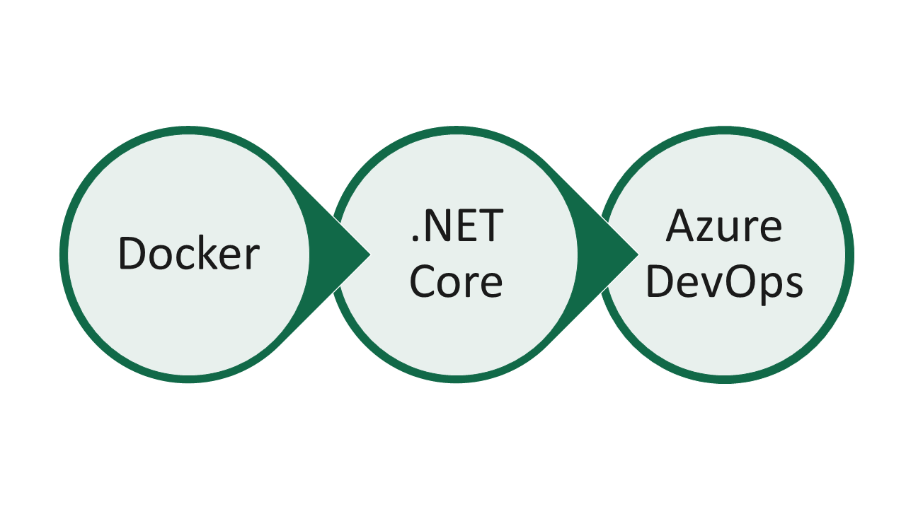
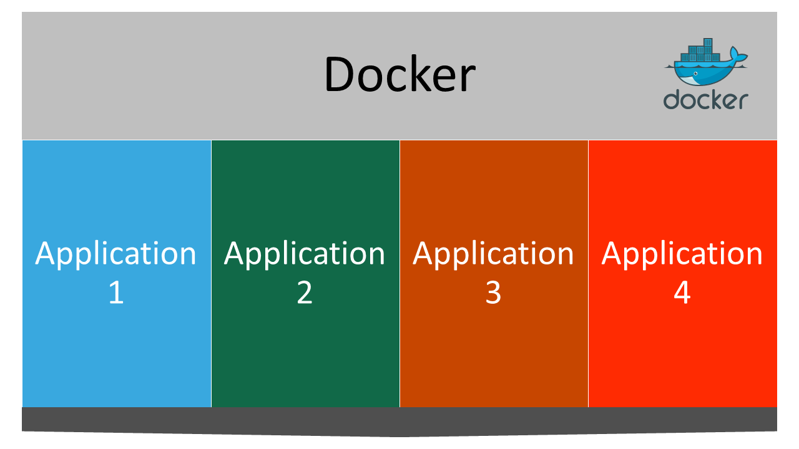
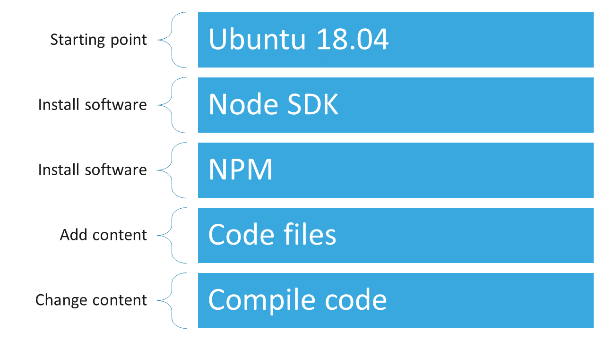
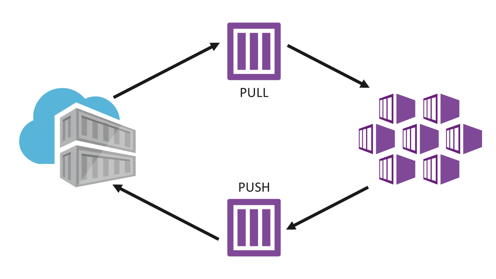
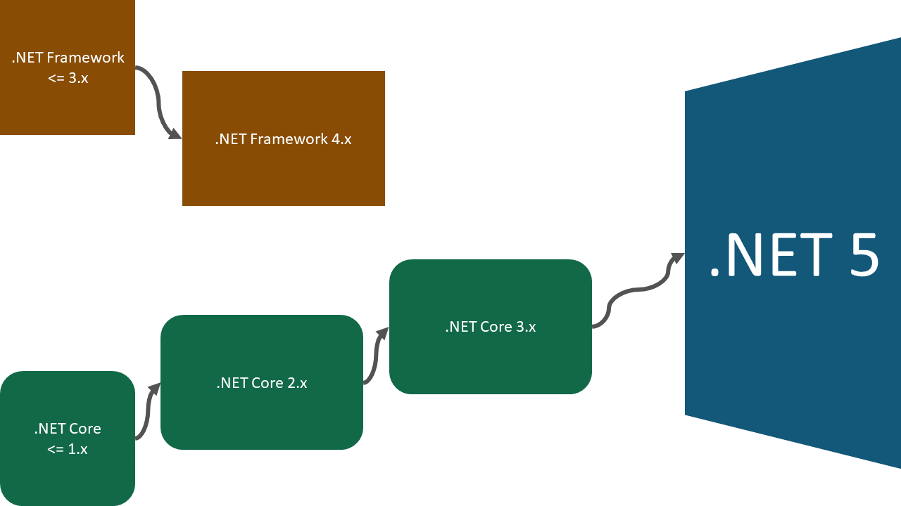
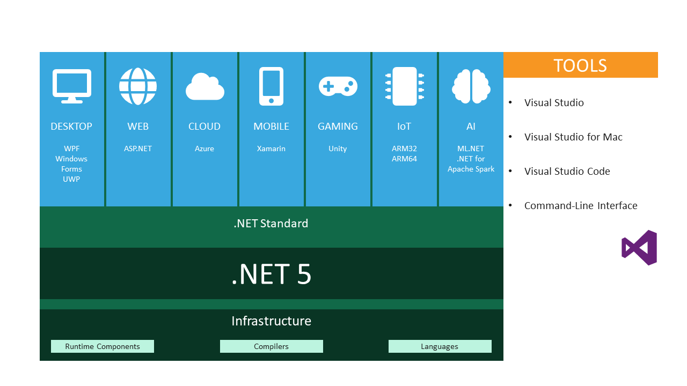
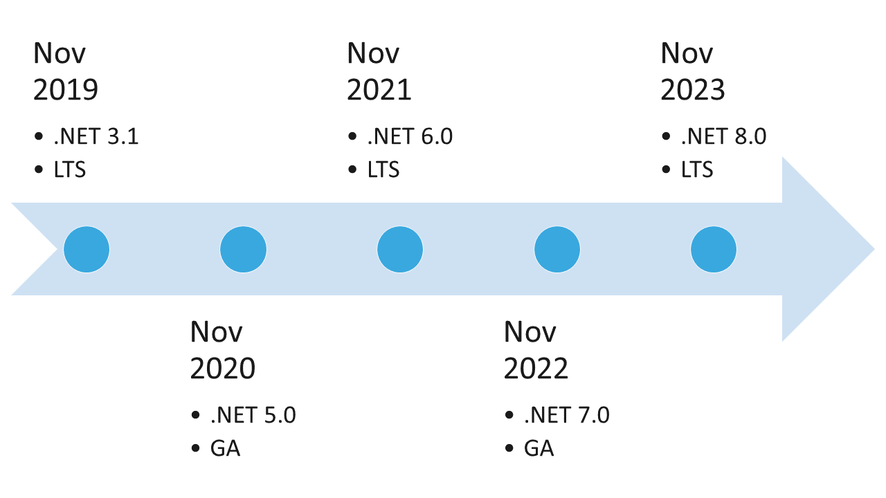
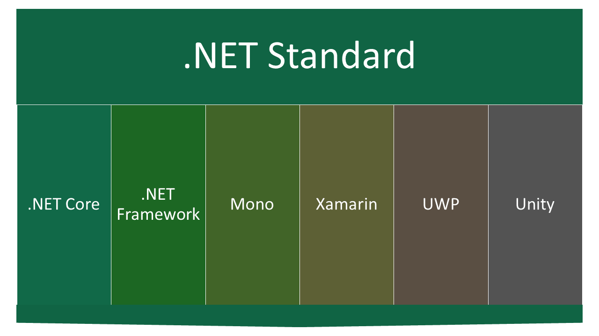
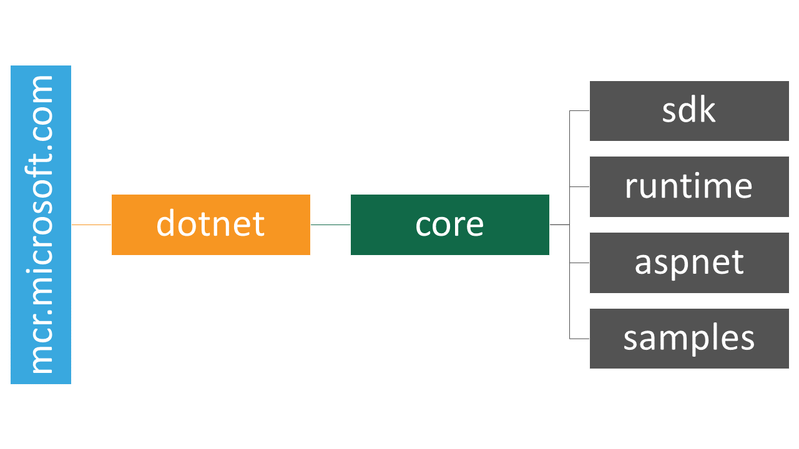
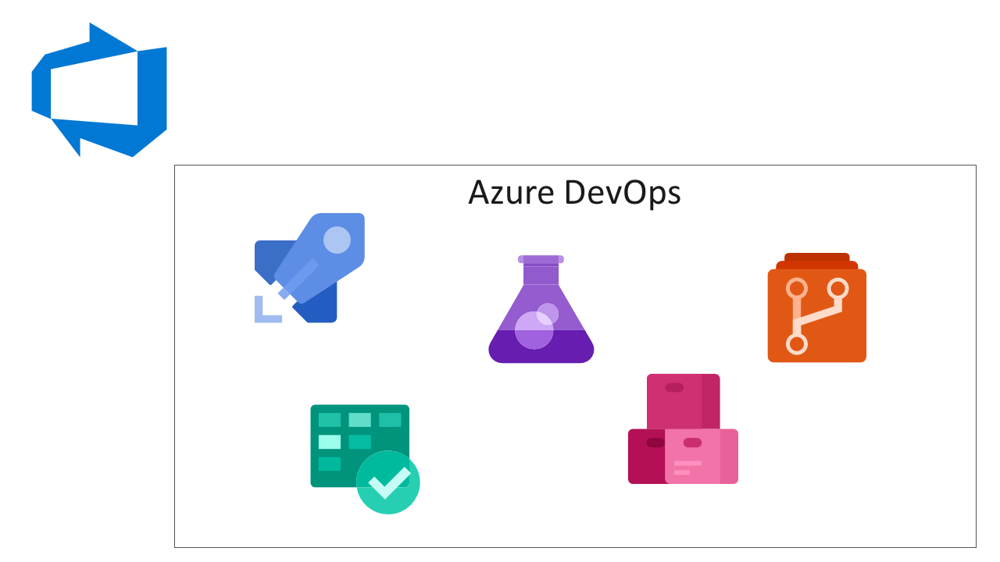

% Workshop: Docker, .NET Core, and Azure DevOps
% Sidney Andrews
% October 3, 2019

# Goals

## Three goals



::: notes
- Start with Docker (and CLI) fundamentals
- Move on to .NET Core CLI fundamentals
- Use Docker to build .NET Core applications
- Use Azure DevOps to build Dockerized .NET Core solutions
:::

## Agenda

- Docker
- Docker CLI
- .NET Core
- .NET Core CLI
- Docker and .NET Core
- Azure DevOps
- Azure DevOps, Docker and .NET Core

::: notes
- Each section is relatively short
:::

# Docker

## What is Docker?

- Docker is an **enterprise container platform**.
- Build and run applications in a portable fashion
- Supported by the majority of cloud providers
- Isolates application dependencies within a logical unit

## Docker



## How can I use Docker?

- Isolate the version of .NET from your host operating system
- Create portable applications that run on a wide variety of cloud providers
    - AWS
    - Azure
    - GCP
- In Azure, create applications that are portable between services
    - App Services
    - Azure Container Instances
    - Azure Batch
    - Azure Virtual Machines
    - Azure Kubernetes Service
    - More...

## Docker installation

- Docker installs two distinct pieces of software:
    - Docker host
    - Docker CLI
- The software can be used together or seperate

## Terminology

- Container
    - Unit of software
    - Includes all dependencies
    - Runs in isolation
- Image
    - Snapshot of a container at a point in time
    - Compiled of **layers** of file-system changes
- Registry
    - Repository of images
    - **Push** images to registry
    - **Pull** images from registry

## Images



## Registries



## Docker Hub

- Registry of Docker container images
- Most popular registry by far
    - Many other registries syndicate to Docker Hub
        - *Ex. Microsoft Container Registry (mcr.microsoft.com)*
- Most base OS container and SDK images come from Docker Hub

# Docker CLI

## Check versions and information

```
# Check client and server versions

docker version


# Check system-wide information

docker info
```

# Demo: *Checking Docker CLI Version*

## Pull images from Docker Hub

```
# Debian OS

docker pull debian


# MySQL database

docker pull mysql


# Ubuntu

docker pull ubuntu
```

## Pull specific image versions

```
# MySQL database latest version

docker pull mysql:latest


# Ubuntu version 14.04

docker pull ubuntu:14.04
```

# Demo: *Pulling container images*

## Running containers

- Containers execute a **single task** and then quit
- Containers for jump boxes, development and web servers need to wait for user input
    - The **single task** is typically something as simple as an ``while(true)`` loop
        - Equivalent in Linux: ``tail -f /dev/null``

## Creating a container from an image

```
# Run debian container

docker run debian


# Run with a specific command (dir)

docker run debian dir
```

## Running a container interactively

```
# Run using --interactive and --tty flags

docker run --interactive --tty debian bash


# Alternatively, run using -it shorthand

docker run -it debian bash
```

# Demo: *Running a container interactively*

## Listing images

```
# List all images

docker images


# List specific images

docker images ubuntu
```

## Searching for images

```
# Search for ubuntu images older than 16.04

docker images --filter "before=ubuntu:16.04"
```

## View running containers

``` 
# List running containers

docker ps


# List all containers (including ones that are not running) 

docker ps --all
```

## Run container in background

```
# Run using --detach flag

docker run --detach debian tail -f /dev/null


# Alternatively, run using -d shorthand

docker run -d debian tail -f /dev/null
```

## View real-time container stats

```
# View stats in real-time

docker stats --all
```

# Demo: *Manage containers using CLI and Visual Studio Code*

## Dockerfiles

- Description of steps to take to create a multi-layer container
- Starts from some base image
- Creates a new layer with each step
- Plain-text file that should be source-controlled
- Used as build instructions to create a Docker container image

## Starting a Dockerfile

```
FROM ubuntu:cosmic
```

## Set working directory

```
FROM ubuntu:cosmic

WORKDIR /app
```

::: notes
- This is a required step for .NET Core container-based applications
:::

## Run a command

```
FROM ubuntu:cosmic

WORKDIR /app

RUN apt-get update
RUN apt-get install unzip
```

## Copy files

```
FROM ubuntu:cosmic

WORKDIR /app

RUN apt-get update
RUN apt-get install unzip

COPY script.js ./
COPY . ./
```

## Add files from the internet

```
FROM ubuntu:cosmic

WORKDIR /app

RUN apt-get update
RUN apt-get install unzip

COPY script.js ./
COPY . ./

ADD http://bit.ly/azbtnsm ./
```

## Create a default command

```
FROM ubuntu:cosmic

WORKDIR /app

RUN apt-get update
RUN apt-get install unzip

COPY script.js ./
COPY . ./

ADD http://bit.ly/azbtnsm ./

ENTRYPOINT ["dir"]
```

## Building a Dockerfile

```
# Build the Dockerfile in the current directory

docker build .


# Build the Dockerfile with a unique tag (name)

docker build --tag utility .
```

# Demo: *Creating and running a container image using a Dockerfile*

# .NET Core

## The .NET story



## .NET 5 platform



## .NET future timeline



::: notes
- .NET Core 3.1 ends the .NET Core roadmap
- Annual releases for .NET
- Ever even-numered release will have long-term support (LTS)
- Schedule is now predictable
:::

## .NET Core

- Cross-platform
- Consistent
    - x86
    - x64
    - ARM
- CLI-centric development
- Flexible deployments
    - Traditional publish
    - Docker containers
    - Self-contained packages
    - Single-file executables
- Open source
- Fully supported for enterprise (<https://dotnet.microsoft.com/platform/support/policy>)

## .NET Standard

- Bridges the gap between yesterday and tomorrow
- Shared namespaces, classes and methods that are **just expected to work**
- Compatible with
    - .NET Framework
    - .NET Core
    - Xamarin
    - Mono
    - Other platforms...

## .NET Standard



## .NET Standard compatibility

| .NET Standard | 1.6 | 2.0 | 2.1 |
| --- | --- | --- | --- |
| .NET Core | 1.0 | 2.0 | 3.0 |
| .NET Framework | 4.6.1 | 4.6.1 | ***N/A*** | 
| Mono | 4.6 | 5.4 | 6.4 |
| Xamarin.iOS | 10.0 | 10.14 | 12.16 |
| Xamarin.Mac | 3.0 | 3.8 | 5.16 |
| Xamarin.Android | 7.0 | 8.0 | 10.0 |
| Universal Windows Platform | 10.0.16299 | 10.0.16299 | ***TBD*** |
| Unity | 2018.1 | 2018.1 | ***TBD*** |

::: notes
- .NET Framework will not support .NET Standard 2.1 or later
- Unity and UWP have not released new versions for .NET Standard 2.1 yet
:::

# Demo: *Installing .NET Core*

# .NET Core CLI

## Check versions and information

```
# Check installed SDK version

dotnet --version
```

## Create console application

```
# View installed templates

dotnet new --help


# View new project options

dotnet new console --help


# Create .NET console project

dotnet new console --output . --name Demo.Client
```

## Run console application

```
# Run current project

dotnet run
```

# Demo: *Create and run console application*

## Publish console application

```
# Default publish

dotnet publish


# Publish with --configuration and --output flags

dotnet publish --configuration Release --output out
```

## Publish self-contained executable

```
# Add --self-contained flag

dotnet publish --configuration Release --output out --self-contained
```

## Update .NET project for cross-platform support

- Many operating systems may not have the **globalization** packages required to run .NET Core applications
- You can either **install the packages** or **disable globalization**

```
# Disable globalization

<ItemGroup>
    <RuntimeHostConfigurationOption Include="System.Globalization.Invariant" Value="true" />
</ItemGroup>
```

## Update .NET project to support single-file executable

- Single-file executable support is done by updating the .csproj file
- **PublishSingleFile**
    - Boolean indicating if you want one or multiple files
- **IncludeSymbolsInSingleFile**
    - Boolean indicating if debug symbols should be combined or seperate

```
# .csproj file properties

<PropertyGroup>
    <PublishSingleFile>true</PublishSingleFile>
    <IncludeSymbolsInSingleFile>true</IncludeSymbolsInSingleFile>
</PropertyGroup>
```

# Demo: *Publishing a single-file, standalone executable*

# Docker and .NET Core

## .NET Core Docker Images



# Demo: *Browsing .NET Core on Docker Hub*

## Pulling and running a .NET Core image

```
# Pull a .NET Core 3.0 SDK image from Docker Hub
docker pull mcr.microsoft.com/dotnet/core/sdk:3.0


# Run this container in detached mode

docker run --detach --tty mcr.microsoft.com/dotnet/core/sdk:3.0 
```

## Copy project files

```
# Copy all files in the current directory to the home directory of the container image

docker cp . $(docker ps --latest --quiet):/home
```

## Connect to the container

```
# Attach to the running container

docker attach $(docker ps --latest --quiet)


# Run dotnet commands

dotnet build

dotnet run
```

## Build a .NET Core project within a Docker container

- Create and run container image
- Create new console project
- Build project
- Test project
- **Optional**: Publish and export project

## Copying files from within Docker to local machine

```
# Docker cp command in reverse order

docker cp $(docker ps --latest --quiet):/home/appname/outputfolder .
```

# Demo: *Build a .NET Core project entirely in Docker*

## Build a .NET Core project using a Dockerfile

- Start with .NET Core base image
- Change working directory
- Copy project files
- Build project
- Set Entrypoint

## .NET Core Dockerfile

```
FROM mcr.microsoft.com/dotnet/core/sdk:3.0

WORKDIR /app

COPY . ./

RUN dotnet publish --output out --configuration Release

ENTRYPOINT ["dotnet", "out/Demo.Client.dll"]
```

## Optimizing the Dockerfile

- Use two different base images
    - .NET Core SDK (*very large*)
    - Ubuntu 18.04 (*much smaller*)
- Build a single-file executable
- Build a self-contained executable
- Copy built code to smaller image

## .NET Core Dockerfile with optimizations

```
FROM mcr.microsoft.com/dotnet/core/sdk:3.0 AS build

WORKDIR /app

COPY . ./

RUN dotnet publish --output out --configuration Release --self-contained --runtime linux-x64

FROM ubuntu:18.04

COPY --from=build /app/out .

ENTRYPOINT ["./Demo.Client"]
```

# Demo: *Build a .NET Core project using a Dockerfile*

## Building and running a web application in Docker

- Create project
- Create Dockerfile
    - Same as before
- Create Startup class with web server configuration
- Use helper classes to bootstrap web server in Program/Main entrypoint

## World's simplest web application project file

```
# Create console application

dotnet new console --output . --name Demo.Web


# Add Microsoft.AspNetCore package from NuGet

dotnet add package Microsoft.AspNetCore
```

## World's simplest web application program class

```
using Microsoft.AspNetCore.Hosting;

public class Program
{
    public static void Main(string[] args) =>
        new WebHostBuilder()
            .UseKestrel()
            .UseStartup<Startup>()
            .Build()
            .Run();
}
```

## World's simplest web application startup class

```
using Microsoft.AspNetCore.Builder;
using Microsoft.AspNetCore.Http;

public class Startup
{
    string css = @"<link rel=""stylesheet"" href=""https://stackpath.bootstrapcdn.com/bootstrap/4.3.1/css/bootstrap.min.css"">";
    string title = "Hey .NET User Group!";

    public void Configure(IApplicationBuilder app) =>
        app.Run(context =>
            context.Response.WriteAsync($@"
                <html>
                    <head>
                        {css}
                    </head>
                    <body>
                        <nav class=""navbar navbar-dark bg-info mb-4"">
                            <span class=""navbar-brand mb-0 h1"">.NET Core on Docker</span>
                        </nav>
                        <main class=""container"">                        
                            <h1 class=""display-1"">
                                {title}
                            </h1>
                        </main>
                    </body>
                </html>
            ")
        );
}
```

## Web application dockerfile

```
FROM mcr.microsoft.com/dotnet/core/sdk:3.0-alpine

WORKDIR /web

COPY . ./

RUN dotnet publish --output site --configuration Release

ENTRYPOINT ["dotnet", "site/Demo.Web.dll"]
```

## Running web applications

```
# Use the --publish flag to bind local port to a container port

docker run --detach --publish 5000:80 web


# Or bind to a randomnly-assigned port

docker run --detach --publish 80 web
```

# Azure DevOps

## Azure DevOps



## Azure DevOps

- Available as a service
- Available as software (*Azure DevOps Server*)
- Replaces
    - Visual SourceSafe
    - Visual Studio Team System
    - Team Foundation Server
    - Team Foundation Services
    - Visual Studio Online
    - Visual Studio Team Services

## Azure Repos

- Repositories-as-a-service
    - Git
    - TFVC (*TFS*)
- Create as many as you want per project
- Supports full Git flow including
    - Branching
    - Pull requests
    - Reviews

## Azure Pipelines

- Builds-as-a-service
- Functionally, very similar to GitHub actions
- Can be used for multiple jobs
    - Continuous Integration builds
    - Continuous Deployment releases
- Moving forward, easy to create jobs using YAML

# Demo: *Create a .NET Project in Azure DevOps*

# Azure DevOps, Docker and .NET Core

## Azure Pipelines YAML

- Best way to create a job
- YAML representation for every common Azure Pipelines task
- Can run your own tasks

## Example YAML build pipeline

```
trigger:
- master
pool:
  vmImage: ubuntu-latest
steps:
- script: echo 'Hello World'
  displayName: Show something
```

# Demo: *Creating a basic YAML build pipeline*

## Example YAML build pipeline for .NET

```
- script: dotnet build
  displayName: Build project
- script: dotnet run
  displayName: Test project
- script: dotnet publish --configuration Release --output out
  displayName: Publish project
```

# Demo: *Creating a basic YAML build pipeline for a .NET application*

## Publishing a build artifact

```
- task: PublishBuildArtifacts@1
  displayName: Publish artifact
  inputs:
    pathtoPublish: out
    artifactName: executable
```

# Demo: *Creating a YAML build pipeline that publishes an artifact*

## Using Docker in YAML builds

## Change build context to a Docker container

```
container:
  image: mcr.microsoft.com/dotnet/core/sdk:3.0
```

# Demo: *Adding Docker to a basic YAML build pipeline*

# Learn More

## Links

| &nbsp; | &nbsp; |
| --- | --- |
| **Katacoda** | <https://katacoda.com/seesharprun/> |
| **Presentation** | <https://github.com/campazure/docker_netcore_containers/> |
| **Get Started with .NET Core** | <https://docs.microsoft.com/dotnet/core/get-started/> |
| **Get Started with Azure DevOps** | <https://docs.microsoft.com/azure/devops/get-started/> |
| **Sample Web Application | <https://dev.azure.com/seesharprun/Web%20Application> |